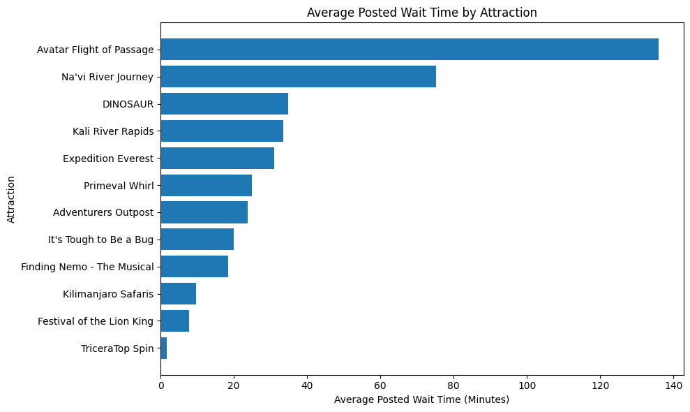
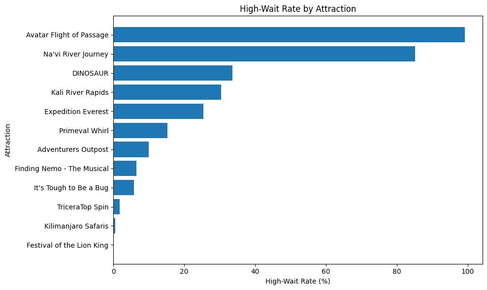
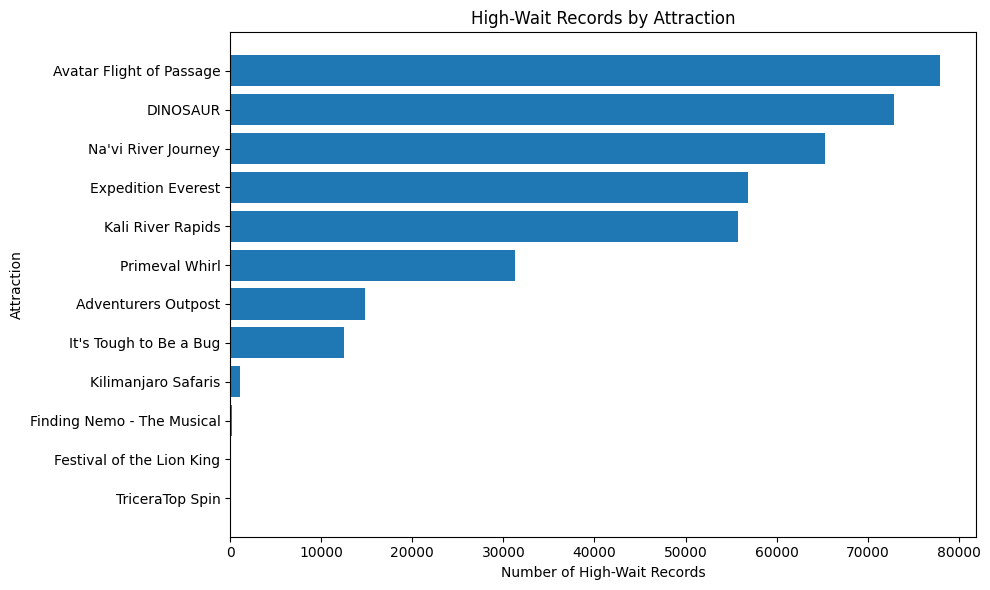
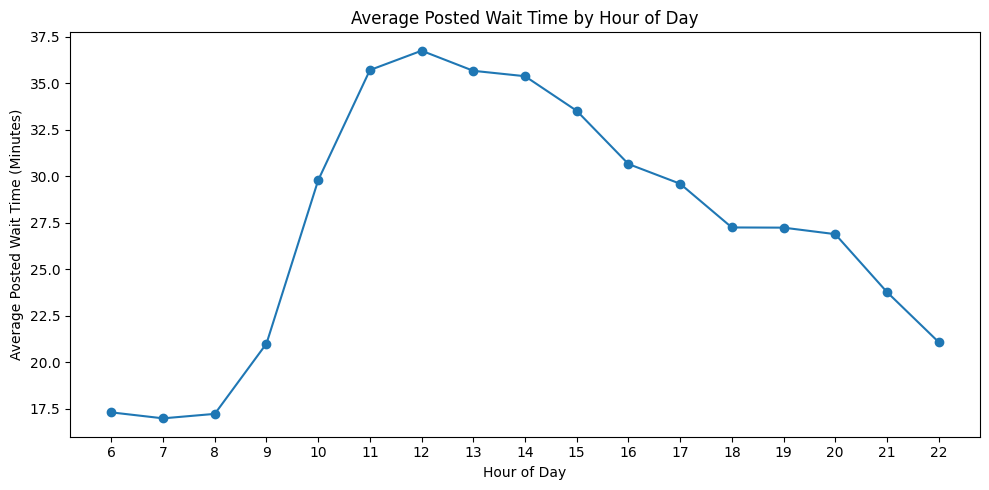
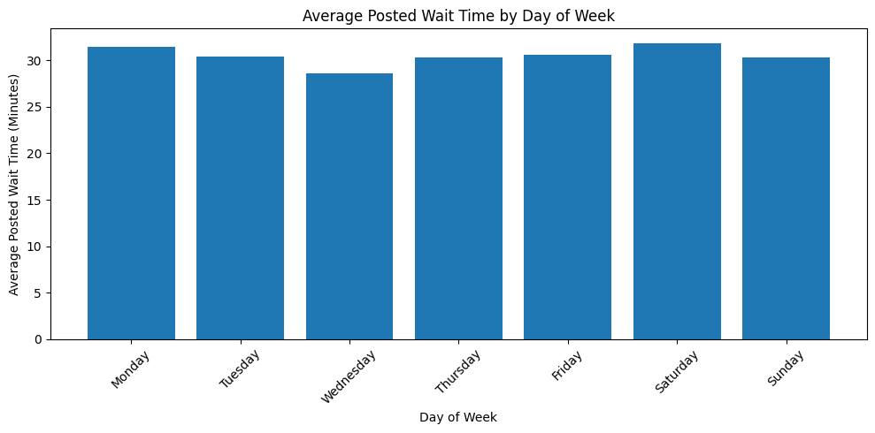
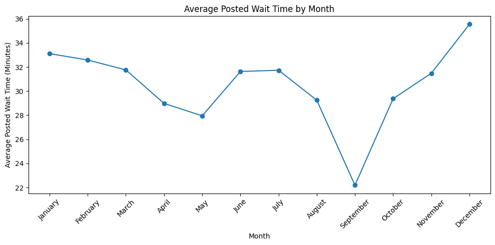

# Disney Animal Kingdom Wait Time & Guest Experience Analytics

## Project Overview

This project analyzes Disney Animal Kingdom attraction wait-time data to identify guest experience pressure points, operational bottlenecks, and time-based wait-time patterns.

The goal of this project is to understand which attractions create the highest wait-time pressure, when waits tend to peak, and how wait-time data can support better operational planning and guest experience decisions.

The analysis uses attraction-level wait-time data from the TouringPlans Disney Animal Kingdom Wait Times dataset.

## Business Questions

This project is designed to answer the following questions:

1. Which Animal Kingdom attractions have the highest average posted wait times?
2. Which attractions most frequently reach high-wait conditions?
3. How do posted wait times change by hour of day?
4. How do posted wait times vary by day of week?
5. Are there seasonal wait-time patterns by month?
6. Which attractions create the greatest guest experience risk based on wait-time volume and frequency?

## Tools Used

- Python
- Pandas
- NumPy
- Matplotlib
- Google Colab / Jupyter Notebook
- GitHub

## Dataset

The project uses the TouringPlans Disney Animal Kingdom Wait Times dataset.

The raw dataset is made up of attraction-level CSV files, with each file representing wait-time records for a specific Animal Kingdom attraction.

The raw CSV files are not included directly in this repository because some files are too large for standard GitHub browser upload. The `data/raw/README.md` file explains how to download the original dataset and where to place the files locally.

Expected source:

```text
https://github.com/TouringPlans/DisneyAnimalKingdomWaitTimes
```

## Repository Structure

```text
disney-animal-kingdom-wait-time-analytics/
│
├── dashboard/
├── data/
│   ├── raw/
│   └── processed/
├── notebooks/
├── reports/
├── sql/
├── visuals/
└── README.md
```

## Analysis Summary
The main notebook loads and combines multiple attraction-level CSV files into one dataset, maps attraction file codes to readable attraction names, cleans invalid wait-time values, creates time-based fields, and builds guest experience KPI fields.

Key fields created include:

Cleaned posted wait time
Cleaned actual wait time
Attraction name
Hour of day
Day of week
Month
Wait-time category
High-wait indicator
Invalid/offline wait-time flags

A high-wait record is defined as a valid posted wait-time record of 45 minutes or more.

The primary analysis focuses on posted wait-time patterns because posted wait-time data was available for most records. Actual wait-time data was only available for a smaller subset and was not paired with posted wait times in the same rows, so posted-versus-actual accuracy was documented as a possible future analysis area.

## Key Findings

Avatar Flight of Passage was the strongest wait-time pressure point.

Avatar Flight of Passage had the highest average posted wait time at approximately 136 minutes. It also had a high-wait rate of 99.20%, meaning nearly every valid posted wait-time record was 45 minutes or longer.

Na'vi River Journey was the second-largest wait-time pressure point.

Na'vi River Journey had an average posted wait time of approximately 75 minutes and a high-wait rate of 85.11%.

Pandora attractions created the clearest guest experience pressure.

Avatar Flight of Passage and Na'vi River Journey stood apart from the rest of the park, suggesting that Pandora attractions were the strongest drivers of long posted waits in the dataset.

Wait times peaked around midday.

Average posted waits were lowest in the early operating hours, increased sharply after 9 AM, and reached their highest point around noon.

Day of week was not a major driver of wait-time differences.

Average posted waits were fairly consistent across the week, suggesting that attraction type and time of day were stronger drivers than weekday alone.

Seasonal patterns were visible.

December had the highest average posted wait time, while September had the lowest. Higher wait times were also visible in several vacation and holiday-adjacent periods.

High-wait risk was concentrated in a small group of attractions.

Avatar Flight of Passage, Na'vi River Journey, DINOSAUR, Expedition Everest, and Kali River Rapids accounted for many of the highest wait-time pressure patterns in the dataset.

## Visual Highlights

### Average Posted Wait Time by Attraction

<p align="center">
  
</p>

This visual compares average posted wait times across Animal Kingdom attractions. Avatar Flight of Passage and Na'vi River Journey stand out as the highest wait-time pressure points.

### High-Wait Rate by Attraction

<p align="center">
  
</p>

This visual shows the percentage of valid posted wait-time records where each attraction had a wait time of 45 minutes or more.

### High-Wait Records by Attraction

<p align="center">
  
</p>

This visual shows the total number of high-wait records by attraction, helping identify attractions that contributed the largest volume of long-wait observations.

### Average Posted Wait Time by Hour of Day

<p align="center">
  
</p>

This visual shows how average posted wait times changed throughout the day, with wait-time pressure rising sharply in the morning and peaking around midday.

### Average Posted Wait Time by Day of Week

<p align="center">
  
</p>

This visual compares average posted wait times by day of week and shows that wait-time patterns were fairly consistent across weekdays and weekends.

### Average Posted Wait Time by Month

<p align="center">
  
</p>

This visual highlights seasonal wait-time patterns, with December showing the highest average posted wait time and September showing the lowest.

## Business Recommendations

Prioritize operational planning around Pandora attractions.

Avatar Flight of Passage and Na'vi River Journey consistently showed the highest wait-time pressure and should be treated as primary guest experience risk areas.

Use early-morning hours to distribute demand.

Since posted waits were lowest early in the day, guests could be encouraged to visit high-demand attractions earlier through planning tools, itinerary suggestions, or app messaging.

Monitor midday wait-time pressure closely.

Wait times peaked around noon, making late morning through early afternoon an important period for staffing, queue management, and guest communication.

Prepare for seasonal demand increases.

December had the highest average posted wait time, while other elevated periods appeared around vacation and holiday travel months.

Use both high-wait rate and high-wait count.

High-wait rate shows how frequently an attraction crossed the long-wait threshold, while high-wait count shows the total volume of long-wait observations. Together, these metrics provide a stronger view of guest experience risk.

Separate attraction downtime from standard wait-time analysis.

Invalid posted wait-time values were flagged and removed from standard wait-time calculations so that unavailable or offline attraction records did not distort average wait metrics.

## Project Files

notebooks/01_data_cleaning_and_wait_time_analysis.ipynb

Main Python notebook for loading, combining, cleaning, analyzing, and visualizing Animal Kingdom wait-time data.

visuals/
Exported charts from the Python analysis.

data/raw/
Documentation for the original raw dataset files and source information.

data/processed/
Documentation for the cleaned dataset output.

sql/
Planned SQL analysis files.

dashboard/
Planned Tableau or BI dashboard files and screenshots.

reports/
Planned executive summaries and business-facing recommendations.

## Future Work

Future additions to this project may include:

SQL analysis using SQLite

Tableau dashboard summarizing key wait-time KPIs

Predictive modeling for high-wait conditions

Additional analysis of actual wait-time records

Posted-versus-actual wait-time accuracy analysis if a matched dataset is added

Comparison across other Disney parks if similar datasets are added
